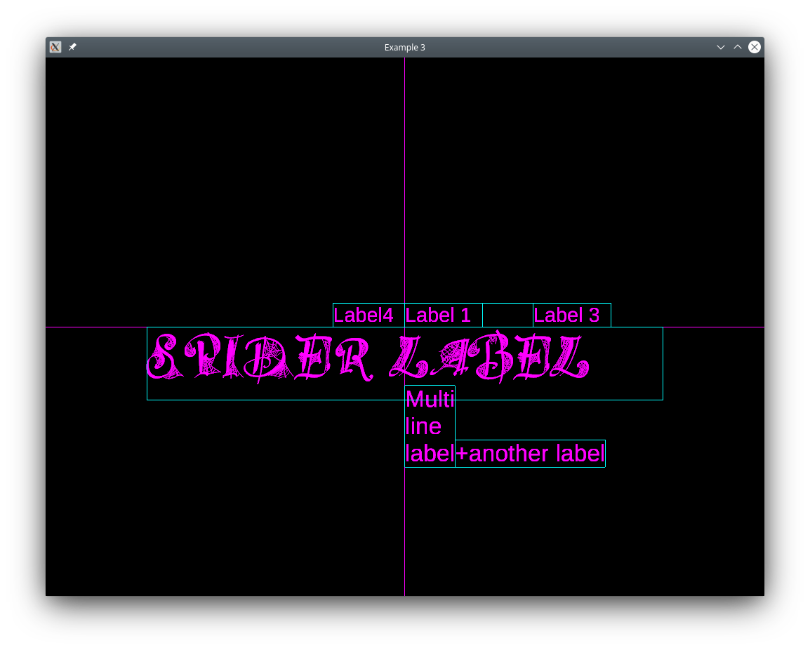
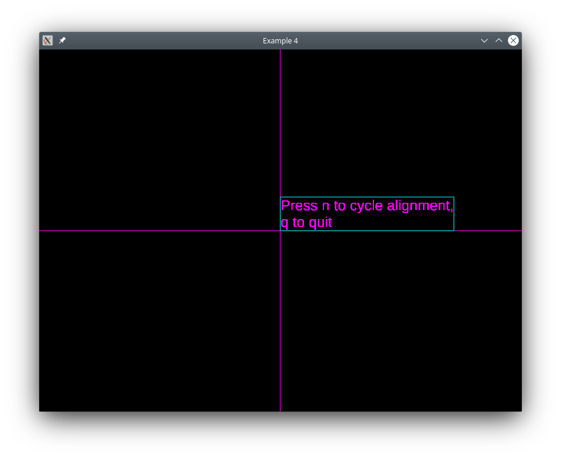
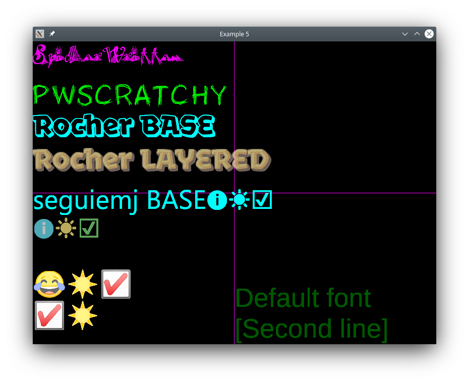

.. include:: include.rst

Examples
===============================================================================
|project|_ contains a :ref:`litGL.examples <litGL.examples.reference>`
package with some usage examples.

:mod:`.examples.example1`
------------------------------                                                                   
.. parsed-literal::                                                             
                                                                                
    $ python3 -m |projectl|.examples.example1                                          

.. _ex1_fig:                                                                   
.. figure:: images/example1.png
    :align: center                                                              
    :figwidth: 90 %                                                             
    :width: 90 %                                                                
    :alt: example1
                                                                                
    example1
                                                                                
Text is rendered in a glfw_ window.

:mod:`.examples.example2`
------------------------------                                                                   
.. parsed-literal::                                                             
                                                                                
    $ python3 -m |projectl|.examples.example2                                          

.. _ex2_fig:                                                                   
.. figure:: images/example2.png
    :align: center                                                              
    :figwidth: 90 %                                                             
    :width: 90 %                                                                
    :alt: example2
                                                                                
    example2
                                                                                
Example of colored text rendered in a glfw_ window.

                                
:mod:`.examples.example3`
------------------------------                                                                   
.. parsed-literal::                                                             
                                                                                
    $ python3 -m |projectl|.examples.example3                                          

.. _ex3_fig:                                                                   

                                                                                
    example3
                                                                                
Many labels showing alignment and a complex font. Text is rendered in a glfw_
window, rectangles show the bounding boxes of the rendered text.

:mod:`.examples.example4`
------------------------------                                                                   
.. parsed-literal::                                                             
                                                                                
    $ python3 -m |projectl|.examples.example4                                          

.. _ex4_fig:                                                                   

                                                                                
    example4
                                                                                
Interactive example of various alignments. Text is rendered in a glfw_ window.

:mod:`.examples.example5`
------------------------------                                                                   
.. parsed-literal::                                                             
                                                                                
    $ python3 -m |projectl|.examples.example5                                          

.. _ex5_fig:                                                                   

                                                                                
    example5
                                                                                
Different fonts and transparency example. Text is rendered in a glfw_ window.
